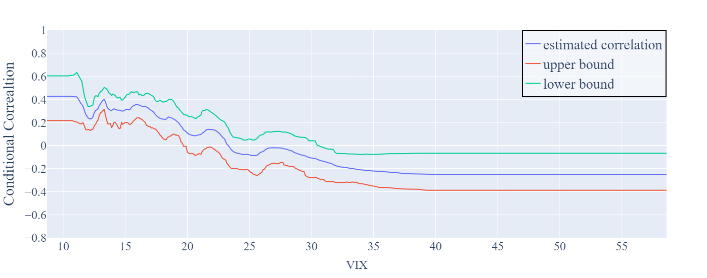
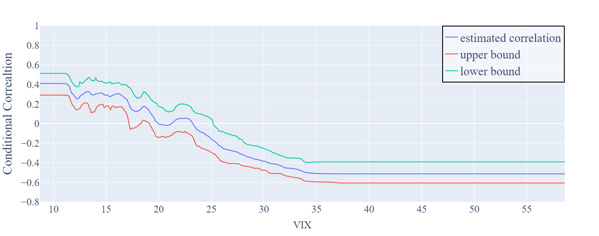
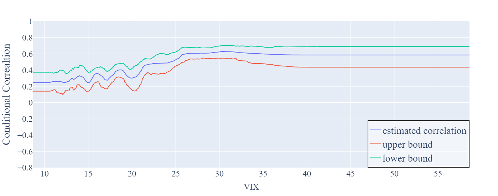
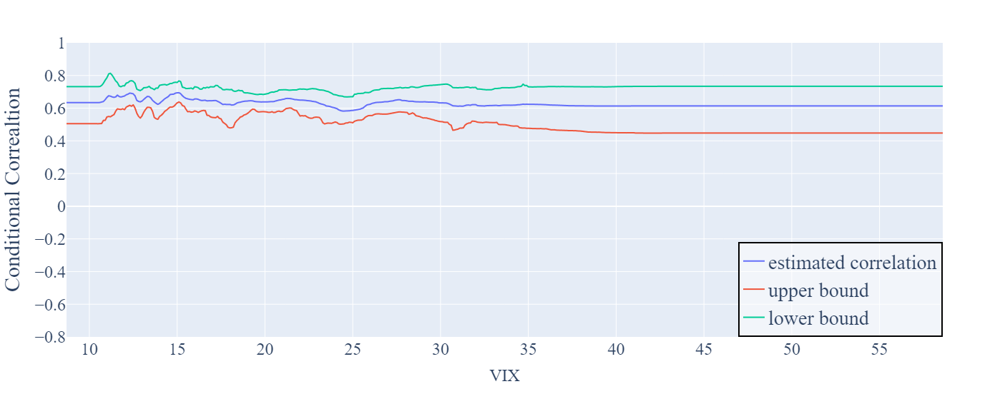
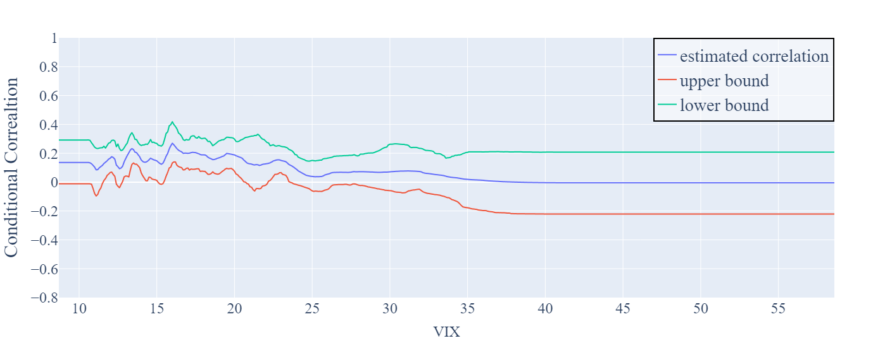

# Conditional Correlation via Generalized Random Forest


We assume a dataset comprising triples $(X_1, W_1, Y_1), \ldots, (X_n, W_n, Y_n)$. Our objective is to capture the conditional correlation between $W$ and $Y$ given $X$.

## Methodology
Our approach involves three key steps:

1. **Initial Regression**:
   We use the GRF (Generalized Random Forest) methodology on the objective function as defined below:
```math
  \min_{c_{YW} , \beta_{YW}} \left\lbrack \sum_{i=1}^n \alpha_{i,YX}(x) \left( Y_i - c_{YW}(x) - \beta_{YW}(x) W_i \right)^2  \right\rbrack
```
   Here, $\alpha_{i,YX}(x)$ weights are computed using trees on $Y$ via $X$.

1. **Reverse Regression**:
   Applying the GRF methodology again but focusing on the reverse relationship:
  
```math
   \min_{c_{WY} , \beta_{WY}} \left\{ \sum_{i=1}^n \alpha_{i,WX}(x) \left( W_i - c_{WY}(x) - \beta_{WY}(x) Y_i \right)^2  \right\}
```


   The weights $\alpha_{i,WX}(x)$ are now computed by using trees on $W$ via $X$.

1. **Estimation of Conditional Correlation**:
   We derive the coefficients as follows:
   
```math
   \beta_{YW}(x) = \frac{\text{Cov}(W,Y \mid X=x)}{\text{Var}(W \mid X=x)}
```

```math
   \beta_{WY}(x) = \frac{\text{Cov}(W,Y \mid X=x)}{\text{Var}(Y \mid X=x)}
```
   

   The conditional correlation is then estimated by:
   ```math
   \rho_{YW \mid X=x}= \text{sign}(\beta_{YW}(x)) \sqrt{|\beta_{YW}(x)\beta_{WY}(x)|} 
   ```
   and the estimate is provided as:
   ```math
   \hat{\rho}_{YW \mid X=x}= \text{sign}(\hat{\beta}_{YW}(x)) \sqrt{|\hat{\beta}_{YW}(x)\hat{\beta}_{WY}(x)|} 
   ```


## Gaussian Simulation

This section reports the results of our methodology applied to two Gaussian cases. The first example captures $\rho_{YW \mid X} \neq \rho_{YW}$, while the second example leads to $\rho_{YW \mid X} = \rho_{YW}$. In both cases, our methodology delivers the expected results accurately as supported by 95% confidence intervals.

### Case 1:
In the first case, we sampled 10,000 data points from a 3-dimensional multivariate normal distribution, with each variable having a mean of 0 and a variance of 1. The covariance between each pair of variables was 0.5. The covariance matrix for this procedure was:
```math
\Sigma_1 = \left \lbrack \begin{matrix}
1 & 0.5 & 0.5 \\
0.5 & 1 & 0.5 \\
0.5 & 0.5 & 1
\end{matrix} \right\rbrack
```


The model's mean correlation observed was 0.33 and independent of X, consistent with the partial correlation.
<p align="center">
  
</p>

### Case 2:
In the second case, another set of 10,000 data points was sampled with the same distribution parameters, but this time, the covariance of the first variable with the other two was set to zero. The covariance matrix for this configuration was:

```math
\Sigma_2 = \left \lbrack \begin{matrix}
1 & 0 & 0 \\
0 & 1 & 0.5 \\
0 & 0.5 & 1
\end{matrix} \right\rbrack
```
<p align="center">
  
</p>

## Non-Linear Simulations

This section outlines the generation of highly non-linear synthetic data to validate our proposed methodology under non-constant conditional correlations (CC).

### Example 1:
Defines the relationship between variables as:
```math
   Y_t = W_t e^{-X_t} + \sqrt{1-e^{-2X_t}} \epsilon_t
```
where $W_t$, and $\epsilon_t$ are i.i.d. standard normal sequences, and $X_t$ is uniformly distributed over $[0,10]$. Here, the conditional correlation, similar to correlations seen in Hedge Funds' data, is $e^{-X_t}$. This setup ensures that $V(Y_t \mid X_t) = V(W_t \mid X_t) = 1$, and hence $\rho_{YW \mid X=x} = \beta(x)$.

We simulate $(X_t, W_t, \epsilon_t)$ for $t = 1, \ldots, 10,000$. The true conditional correlations, estimates, and 95% confidence intervals confirm the effectiveness of our methodology for capturing $\rho_{YW \mid X=x}$ over $x \in [0,10]$.

<p align="center">
  
</p>

### Example 2:
Reveals differences between $\beta(x)$ and $\rho_{YW \mid x}$:
```math
   Y_t = W_t e^{-X_t} + \epsilon_t
```
with $W_t$, and $\epsilon_t$ as i.i.d. standard normal sequences. The variance and covariance are given by:
- $V(W_t \mid X_t) = 1$
- $V(Y_t \mid X_t) = e^{-2X_t} + 1$
- $Cov(Y_t, W_t \mid X_t) = e^{-X_t}$

This leads to the equations for conditional correlation and GRF parameters:

```math
   \rho_{YW \mid X=x} = \frac{e^{-x}}{\sqrt{e^{-2x} + 1}},
```

```math
   \beta_{YW}(x) = e^{-x},
```

```math
   \beta_{WY}(x_0) = \frac{e^{-x}}{e^{-2x} + 1}
```

<p align="center">
  
</p>


## Model Overview and Empirical Analysis

Our model effectively incorporates a variety of features, notably the VIX index from CBOE, reflecting market dynamics and sentiment. We investigate the correlation dynamics between the S&P 500 and various hedge fund indices: Macro Hedge Funds (HFRXM), Systematic Diversified Macro Hedge Funds (HFRXSDV), and others.

### Empirical Setup
The analysis uses daily data over the past twenty years, applying Generalized Random Forest (GRF) with 1000 trees, targeting a minimum sample size of 35 in each leaf. The study focuses on the correlation between the market portfolio (S&P500) and hedge funds during varying market conditions to assess hedge funds' viability as safe havens during downturns.


**HFRXM and HFRXSDV:** These indices sometimes become uncorrelated or negatively correlated with the market during high volatility, suggesting their potential as protective investments during crises.


<p align="center">
  <div style="display:block; text-align:center; margin:auto;">
    
    <p style="text-align:center;">Correlation trends between the S&P 500 and Macro Hedge Funds (HFRXM) under varying market conditions.</figcaption>
  </div>
</p>


<p align="center">
  <div style="display:block; text-align:center; margin:auto;">
    
    <p style="text-align:center;">Correlation trends between the S&P 500 and Systematic Diversified Macro Hedge Funds (HFRXSDV) under varying market conditions.</figcaption>
  </div>
</p>


**HFRXMA:** Shows an increase in correlation during times of high variance, opposite to what would be ideal for protection.
<p align="center">
  <div style="display:block; text-align:center; margin:auto;">
    
    <p style="text-align:center;">Correlation trends between the S&P 500 and Event-driven merger arbitrage (HFRXMA) under varying market conditions.</figcaption>
  </div>
</p>

 **HFRXMD and HFRXEMN:** Indicate no significant change in correlation with varying market variances, remaining relatively indifferent.

<p align="center">
  <div style="display:block; text-align:center; margin:auto;">
    
    <p style="text-align:center;">Correlation trends between the S&P 500 and Market Directional Hedge Fund (HFRXMD) under varying market conditions.</p>
  </div>
</p>
<p align="center">
  <div style="display:block; text-align:center; margin:auto;">
    
    <p style="text-align:center;">Correlation trends between the S&P 500 and Equity Market Neutral Strategy (HFRXEMN) under varying market conditions.</figcaption>
  </div>
</p>

This analysis confirms the ability of our methodology to capture and analyze dynamic conditional correlations, helping to inform investment decisions during various market conditions.
