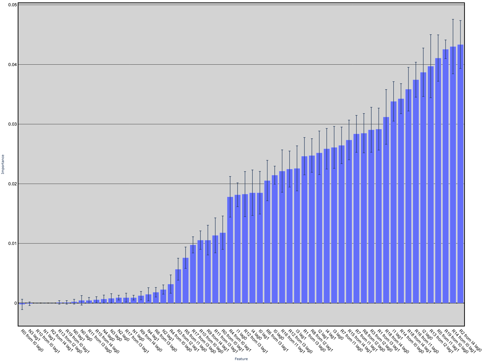
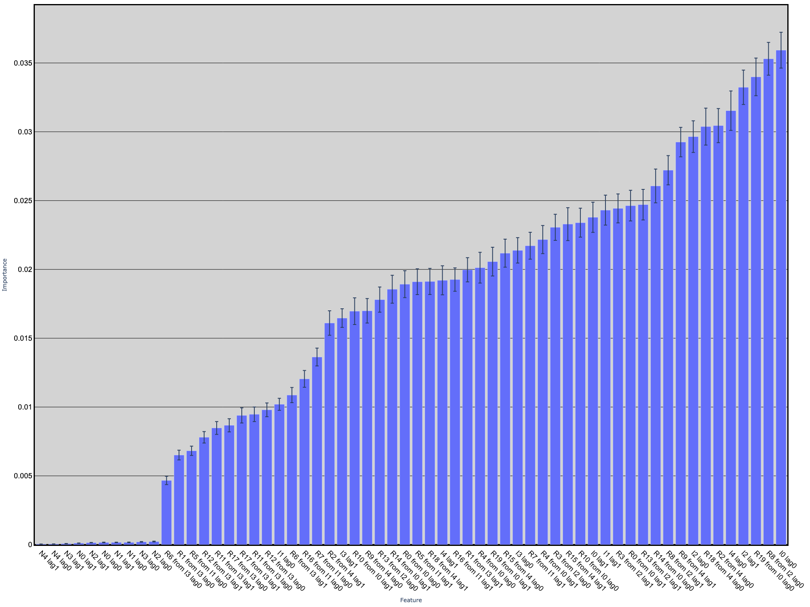
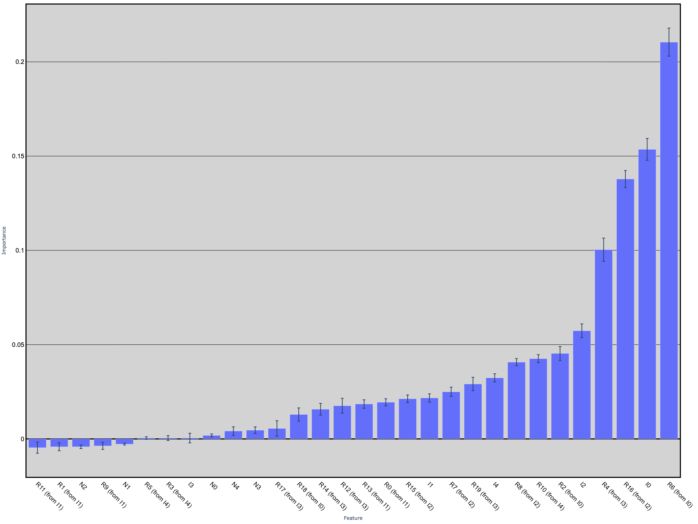
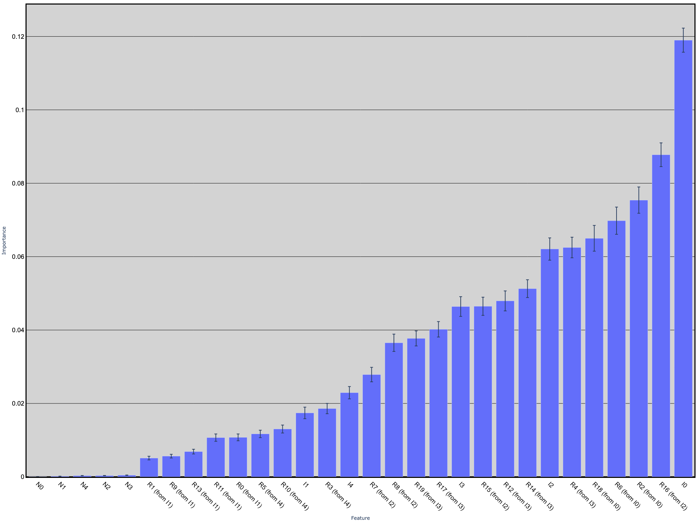
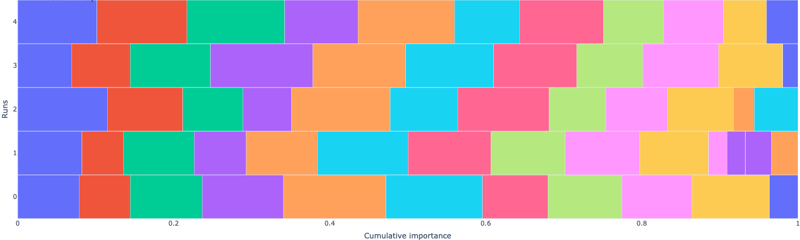
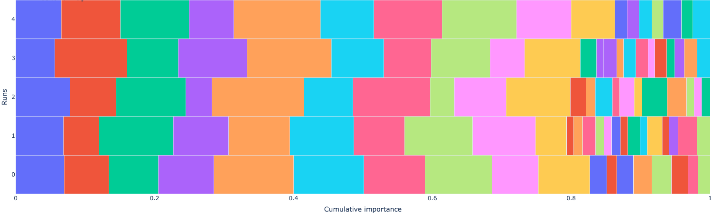
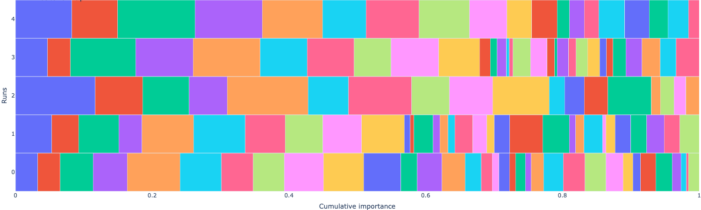
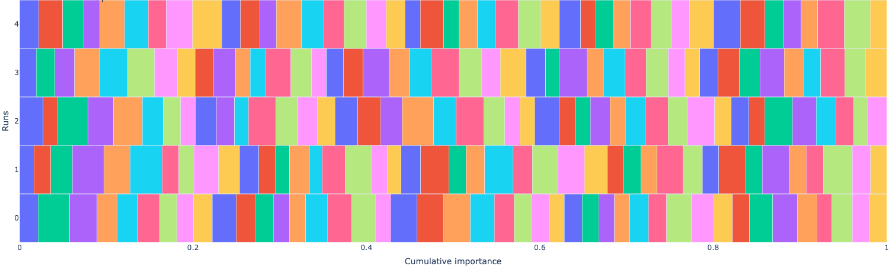
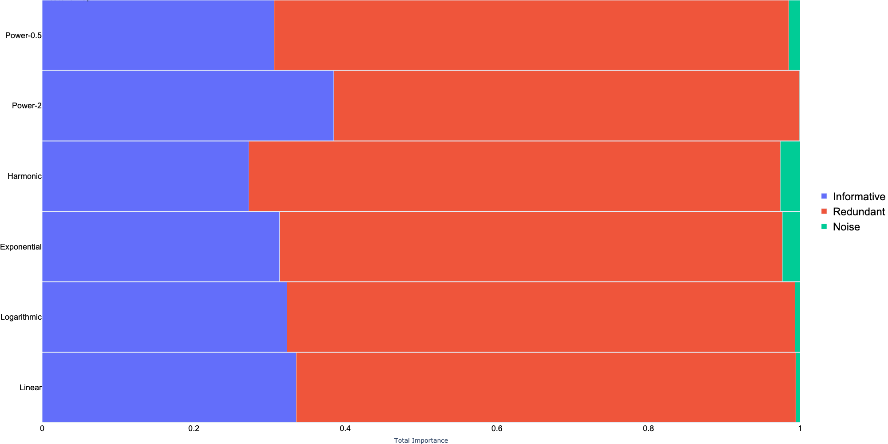
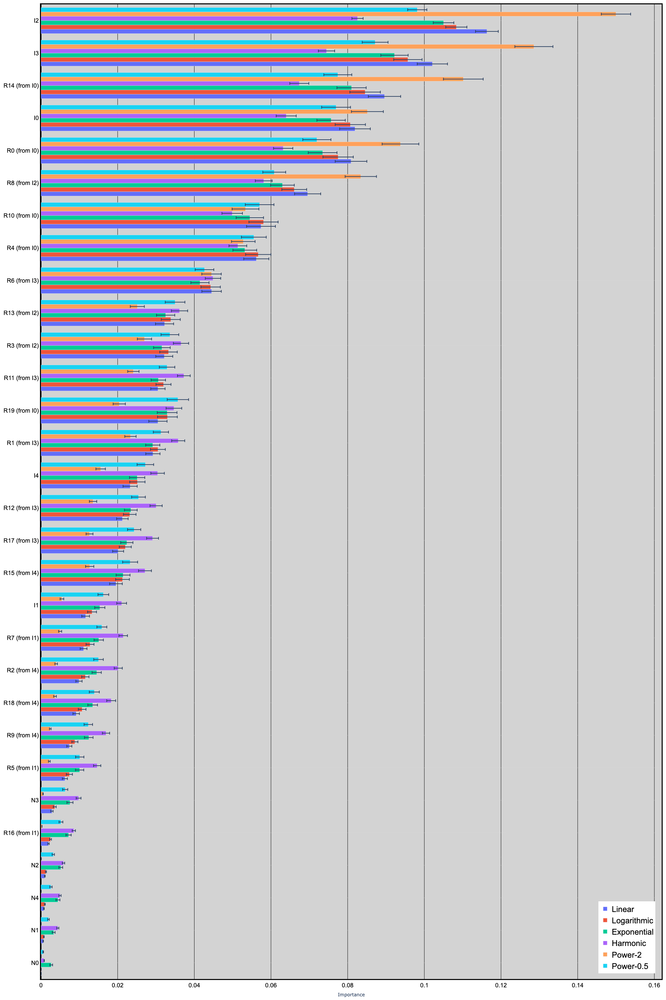

# Stability Weighted Ensemble Feature Importance (SWEFI) Method

This repository contains the implementation and analysis of the Stability Weighted Ensemble Feature Importance (SWEFI) method, which enhances the stability and interpretability of feature importance in machine learning models. The SWEFI method integrates stability selection with ensemble learning to address the instability and inconsistency of existing feature importance methods, particularly in high-dimensional and noisy financial datasets.

## Abstract

The primary goal of this research is to develop and evaluate the SWEFI method to enhance the reliability and interpretability of feature importance in machine learning models. The study aims to address the instability and inconsistency of existing feature importance methods, which undermine their reliability in high-stakes applications such as finance. The SWEFI method combines stability selection with ensemble learning, producing feature importance scores that are both stable and interpretable.

## Methodology

### Algorithm: Stability Weighted Ensemble Feature Importance (SWEFI)

The SWEFI algorithm aims to provide a consistent and reliable measure of feature significance. The steps involved in the algorithm are detailed below:

# Algorithm: Stability Weighted Ensemble Feature Importance (SWEFI)

**Input:**
- $` \mathcal{D} = (X, y) `$: Input Dataset, where $`X: \mathcal{F} = \{ f_i \}_{i=1}^m `$, $` \forall 1 \leq i \leq m: \; f_i \in \mathbb{R}^n `$ and $` y \in \mathbb{R}^n `$
- $` \mathcal{FI}_{1 \leq i \leq k} \subset \{ \text{MDA, MDI, ... } \} `$: Feature Importance Methods
- $` \mathcal{M}_{1 \leq i \leq k} \subset \{ \text{SVM, LDA, ... } \} `$ Learning Models
- $`\text{resampling} \in \{ \text{cv}, \text{bootstrap}, ... \}`$: Resampling method
- $` k `$: The top $` k\% `$ of the features
- $` \tau `$: Threshold for feature selection using cumulative sum

**Output:**
- $` \mathcal{F}_s \subset \mathcal{F}_{1 \leq i \leq m} `$: Selected features

---

1. $` X^* \gets \text{preprocess}(X) `$
2. $` \mathcal{M}_i^* \gets \text{hpo}(\mathcal{M}_i) `$
3. $` \mathcal{S}_{1 \leq i \leq r} \gets \text{resampling}(\mathcal{D}) `$

**For** $` S_i \in \mathcal{S}_{1 \leq i \leq r} `$:
   - **For** $` (\mathcal{M}_j, \mathcal{FI}_j) \in (\mathcal{M}, \mathcal{FI}) `$:
     - **For** $` f \in \mathcal{F} `$:
       - $` I_{i,j}(f) \gets \mathcal{FI}_j(S_i, M_j) `$

4. $` T \gets k \times |\mathcal{F}| / 100 `$

**For** $` f \in \mathcal{F} `$:
   - $` SS(f) = \frac{1}{|\mathcal{M}||\mathcal{S}|} \sum \mathbb{I}\left( \text{rank}(f, I_{i,j}) \leq T \right) `$

5. Normalize $` SS `$ to 1

**For** $` f \in \mathcal{F} `$:
   - $` I: EI(f) \gets \frac{\sum_{i,j} SS(f) \cdot I_{i,j}(f)}{\sum_{i,j} SS(f)} `$

6. $` \mathcal{F}_s \gets \mathcal{F}[\text{select}(I, th)] `$

**Return** $` \mathcal{F}_s `$

### Key Equations

#### Feature Importance Calculation

For each feature $ f \in \mathcal{F} $, the importance score $ I_{i,j}(f) $ is computed as follows:

```math
    I_{i,j}(f) = \mathcal{FI}_j(S_i, M_j)  
```

#### Stability Score Calculation

The stability score $ SS(f) $ for each feature $ f $ is calculated by averaging the values of the indicator function across all combinations of subsets and learning models - feature importance methods:

```math
    SS(f) = \frac{1}{|\mathcal{M}| \cdot |\mathcal{S}|} \sum_{i=1}^{|\mathcal{S}|} \sum_{j=1}^{|\mathcal{M}|} \mathbb{I}\left( \text{rank}(f, I_{i,j}) \leq T \right)
```

#### Ensemble Importance Calculation

The ensemble importance $ EI(f) $ for each feature is computed as follows:

```math
    EI(f) = \frac{SS(f)}{\sum_f SS(f)} \cdot {\sum_{i,j} I_{i,j}(f)}    
```

## Results

### Performance Comparison

The performance of SWEFI is compared against traditional methods such as MDI and MDA. The results demonstrate SWEFI's superior stability and interpretability.

<p align="center">
  
  
</p>

<p align="center">
  
  
</p>

### Algorithm Stability Comparison

SWEFI demonstrates greater stability compared to previous methods.

<p align="center">
  
  
</p>

<p align="center">
  
  
</p>

### Weighting Strategies

Comparison between different weighting strategies applied to the dataset shows the Power weighting strategy (with $ \alpha > 1 $) achieving a higher total sum of scores on the informative features.

<p align="center">
  
  
</p>