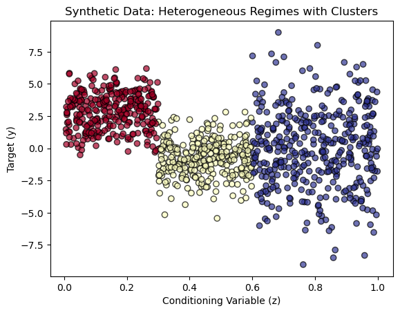

# Heterogeneous Hedged Random Forest Regressor

## Overview

The **Heterogeneous Hedged Random Forest Regressor** (HH-RF) is an advanced ensemble learning method designed to handle heterogeneous data with distinct regimes. By incorporating conditional weighting and partitioning of the conditioning variable space, HH-RF enhances predictive accuracy and adaptability in complex datasets where traditional models may falter.

## Mathematical Methodology

### Conditional Weighting for Heterogeneous Data

Traditional ensemble methods often utilize fixed weights for combining individual forecasts, which may not account for underlying heterogeneity in the data. To address this limitation, we propose an extension where the weights are functions of a conditioning variable $z$ (or a set of them), inspired by the Generalized Random Forest (GRF) methodology.

#### Partitioning the Conditioning Space

To ensure scalability and computational efficiency, we partition the conditioning variable space using clustering techniques and compute optimal weights for each partition. During inference, a new prediction point is assigned to its corresponding partition, and the precomputed weights for that partition are utilized. This approach reduces the computational burden by avoiding the need to calculate weights for arbitrary $z$ values.

#### Optimal Weighting per Partition

For each partition $\mathcal{P}_k$, we aim to determine weights $w^{(k)} = (w_1^{(k)}, \dots, w_p^{(k)})'$ that minimize the conditional mean squared error (MSE) within the partition. Formally, the optimization problem for each $k$ is:

```math
\begin{aligned}
& \min_{w^{(k)}} \; \frac{1}{|\mathcal{P}_k|} \sum_{i \in \mathcal{P}_k} \left( y_i - \sum_{j=1}^p w_j^{(k)} \mathcal{M}_j(x_i) \right)^2 \\
\text{s.t.} \quad & \sum_{j=1}^p w_j^{(k)} = 1, \quad \|w^{(k)}\|_1 \leq \kappa.
\end{aligned}
```

This can be reformulated using the estimated conditional moments within each partition. Let $e_k(z) = \left( e_1^k(z), \dots, e_p^k(z) \right)'$ be the forecast error vector within cluster $\mathcal{P}_k$. We estimate the conditional mean vector $\mu_k$ and covariance matrix $\Sigma_k$ within each cluster:

```math
\mu_k = \mathbb{E}[e_k(z) \mid z \in \mathcal{P}_k], \quad \Sigma_k = \mathbb{Var}[e_k(z) \mid z \in \mathcal{P}_k].
```

These can be estimated using the sample $\{(y_i, x_i, z_i)\}_{i=1}^n$. For each partition $\mathcal{P}_k$, we identify a neighborhood $\mathcal{N}(\mathcal{P}_k)$ of similar conditioning variable values within $\mathcal{P}_k$ and compute:

```math
\begin{aligned}
\hat{\mu}_k &= \frac{1}{|\mathcal{N}(\mathcal{P}_k)|} \sum_{i \in \mathcal{N}(\mathcal{P}_k)} e_i(z_i), \\
\hat{\Sigma}_k &= \frac{1}{|\mathcal{N}(\mathcal{P}_k)| - 1} \sum_{i \in \mathcal{N}(\mathcal{P}_k)} \left( e_i(z_i) - \hat{\mu}_k \right) \left( e_i(z_i) - \hat{\mu}_k \right)'.
\end{aligned}
```

The optimization problem becomes:

```math
\begin{aligned}
& \min_{w^{(k)}} \; \left( w^{(k)\top} \mu_k \right)^2 + w^{(k)\top} \Sigma_k w^{(k)} \\
\text{s.t.} \quad & w^{(k)\top} \mathbf{1} = 1, \quad \|w^{(k)}\|_1 \leq \kappa.
\end{aligned}
```

This is a convex quadratic programming problem for each partition $k$, solvable via standard numerical optimization techniques.

### Weight Assignment During Inference

Given a new prediction point with conditioning variable $z^*$, we assign it to the nearest partition $\mathcal{P}_k$ based on the clustering algorithm. The corresponding precomputed weights $w^{(k)}$ are then used to combine the individual forecasts:

```math
\hat{f}_{w^{(k)}}(x^*) = \sum_{j=1}^p w_j^{(k)} \mathcal{M}_j(x^*).
```

## Experimental Setup

To demonstrate the capabilities of the HH-RF methodology, we designed a synthetic dataset that exhibits clear regime shifts and heterogeneous noise structures. This setup allows us to effectively compare the performance of three models: **Standard Random Forest (RF)**, **Hedged Random Forest (H-RF)**, and the proposed **Heterogeneous Hedged Random Forest (HH-RF)**.

### Data Generation

We generate a dataset comprising $n = 1000$ samples with $d = 5$ predictor variables $\mathbf{X} = [X_1, X_2, \dots, X_5]$ and a conditioning variable $z$. The target variable $y$ is defined as a piecewise function of $\mathbf{X}$ and $z$, incorporating three distinct regimes:

```math
y = f(\mathbf{X}, z) + \epsilon(z),
```

where $f(\mathbf{X}, z)$ is defined as:

```math
f(\mathbf{X}, z) =
\begin{cases}
    2X_1 - X_2 + 3, & \text{if } z < 0.3 \quad \text{(Regime 1: Linear)} \\
    \sin(2\pi X_1) + X_2^2 - 1, & \text{if } 0.3 \leq z < 0.6 \quad \text{(Regime 2: Non-linear)} \\
    0.5X_1 - 2X_3 + \eta, & \text{if } z \geq 0.6 \quad \text{(Regime 3: Noisy)}
\end{cases}
```

Here, $\eta \sim \mathcal{N}(0, 2^2)$ introduces high noise in Regime 3. The noise term $\epsilon(z)$ varies with $z$ to reflect heterogeneous noise levels:

```math
\epsilon(z) =
\begin{cases}
    \mathcal{N}(0, 0.5^2), & \text{if } z < 0.3 \quad \text{(Low Noise)} \\
    \mathcal{N}(0, 1^2), & \text{if } 0.3 \leq z < 0.6 \quad \text{(Medium Noise)} \\
    \mathcal{N}(0, 2^2), & \text{if } z \geq 0.6 \quad \text{(High Noise)}
\end{cases}
```

This formulation ensures that each regime not only has distinct functional relationships between predictors and the target but also varying levels of unpredictability, thereby challenging models to adapt to conditional heterogeneity.

### Visualizing the Synthetic Data

We visualize the synthetic data to illustrate the distinct regimes based on the conditioning variable $z$. Each cluster corresponds to a specific regime with unique relationships and noise levels.



*Figure 1: Synthetic Dataset with Heterogeneous Regimes*

## Usage

### Training and Evaluating Models

The following code demonstrates how to train and evaluate the three models: Standard RF, H-RF, and HH-RF, using the synthetic dataset.

```python
import numpy as np
import matplotlib.pyplot as plt

# Set random seed for reproducibility
np.random.seed(42)

# Number of samples and dimensions
n_samples = 1000
n_features = 5

# Generate random features (X)
X = np.random.uniform(-1, 1, size=(n_samples, n_features))

# Generate conditioning variable (z)
z = np.random.uniform(0, 1, size=n_samples)

# Define piecewise function f(X, z)
def f(X, z):
    # Regime 1: z < 0.3 -> Linear relationship
    linear = X[:, 0] * 2 + X[:, 1] * (-1) + 3
    # Regime 2: 0.3 <= z < 0.6 -> Non-linear relationship
    nonlinear = np.sin(2 * np.pi * X[:, 0]) + X[:, 1]**2 - 1
    # Regime 3: z >= 0.6 -> Mixed relationship with high noise
    noisy = X[:, 0] * 0.5 + X[:, 2] * (-2) + np.random.normal(0, 2, size=X.shape[0])

    # Combine regimes based on z
    y = np.where(z < 0.3, linear,
                 np.where(z < 0.6, nonlinear, noisy))
    return y

# Generate target variable y
y = f(X, z)

# Add heterogeneous noise
noise = np.where(z < 0.3, np.random.normal(0, 0.5, size=n_samples),  # Low noise
                 np.where(z < 0.6, np.random.normal(0, 1, size=n_samples),  # Medium noise
                          np.random.normal(0, 2, size=n_samples)))  # High noise
y += noise

# Visualize data
# Define clusters based on z values
cluster_1 = z < 0.3  # Cluster 1: z < 0.3
cluster_2 = (z >= 0.3) & (z < 0.6)  # Cluster 2: 0.3 <= z < 0.6
cluster_3 = z >= 0.6  # Cluster 3: z >= 0.6

# Assign colors to the clusters
colors = np.zeros_like(z, dtype=int)
colors[cluster_1] = 0  # Cluster 1: Color 0 (e.g., red)
colors[cluster_2] = 1  # Cluster 2: Color 1 (e.g., blue)
colors[cluster_3] = 2  # Cluster 3: Color 2 (e.g., green)

# Define the color map
cmap = plt.get_cmap('RdYlBu')  # Or any other color map

# Plot the data with colors representing the clusters
plt.scatter(z, y, c=colors, cmap=cmap, alpha=0.7, edgecolors='k', label="Target Variable (y)")
plt.xlabel("Conditioning Variable (z)")
plt.ylabel("Target (y)")
plt.title("Synthetic Data: Heterogeneous Regimes with Clusters")
plt.show()

from sklearn.model_selection import train_test_split
from sklearn.ensemble import RandomForestRegressor
from hedged_random_forests import HedgedRandomForestRegressor
from heterogeneous_hedged_random_forests import HeterogeneousHedgedRandomForestRegressor

# Split data into training and testing
X_train, X_test, y_train, y_test, z_train, z_test = train_test_split(X, y, z, test_size=0.3, random_state=42)

# Fit and evaluate Vanilla RF
vanilla_rf = RandomForestRegressor(n_estimators=100, random_state=42)
vanilla_rf.fit(X_train, y_train)
rf_preds = vanilla_rf.predict(X_test)
rf_mse = np.mean((y_test - rf_preds) ** 2)

# Fit and evaluate H-RF
h_rf = HedgedRandomForestRegressor(n_estimators=100, random_state=42)
h_rf.fit(X_train, y_train)
h_rf_preds = h_rf.predict(X_test)
h_rf_mse = np.mean((y_test - h_rf_preds) ** 2)

# Fit and evaluate HH-RF
hh_rf = HeterogeneousHedgedRandomForestRegressor(n_estimators=100, n_partition=3, random_state=42)
hh_rf.fit(X_train, y_train, z_train.reshape(-1, 1))
hh_rf_preds = hh_rf.predict(X_test, z_test.reshape(-1, 1))
hh_rf_mse = np.mean((y_test - hh_rf_preds) ** 2)

# Print results
print(f"Vanilla RF MSE: {rf_mse}")
print(f"H-RF MSE: {h_rf_mse}")
print(f"HH-RF MSE: {hh_rf_mse}")

# Optional: Analyze regime-specific performance
for regime, regime_name in [(z_test < 0.3, "Regime 1 (Linear)"),
                            ((z_test >= 0.3) & (z_test < 0.6), "Regime 2 (Non-Linear)"),
                            (z_test >= 0.6, "Regime 3 (Noisy)")]:
    regime_mse = np.mean((y_test[regime] - hh_rf_preds[regime]) ** 2)
    print(f"{regime_name} MSE (HH-RF): {regime_mse}")

import pandas as pd
from sklearn.metrics import mean_absolute_error, r2_score

# Compute additional metrics (MAE, R²)
metrics = {
    'Model': ['Standard RF', 'Hedged RF', 'Heterogeneous Hedged RF'],
    'MSE': [rf_mse, h_rf_mse, hh_rf_mse],
    'MAE': [
        mean_absolute_error(y_test, rf_preds),
        mean_absolute_error(y_test, h_rf_preds),
        mean_absolute_error(y_test, hh_rf_preds)
    ],
    'R²': [
        r2_score(y_test, rf_preds),
        r2_score(y_test, h_rf_preds),
        r2_score(y_test, hh_rf_preds)
    ]
}

metrics_df = pd.DataFrame(metrics)
print(metrics_df)
```

### Expected Output

The following table summarizes the performance of each model:

| Model                      | MSE    | MAE    | $R^2$  |
|----------------------------|--------|--------|------------|
| **Standard RF**            | 7.0339 | 2.1511 | 0.0041     |
| **Hedged RF**              | 6.9409 | 2.1070 | 0.0172     |
| **Heterogeneous Hedged RF**| 6.8365 | 2.0866 | 0.0320     |
