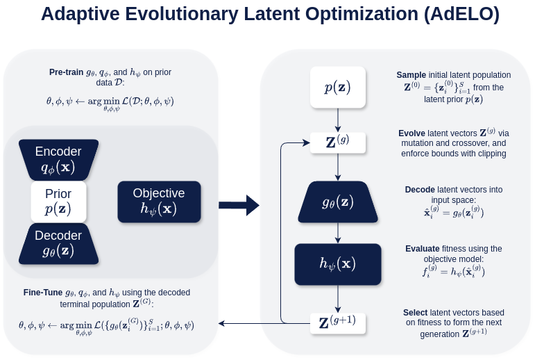
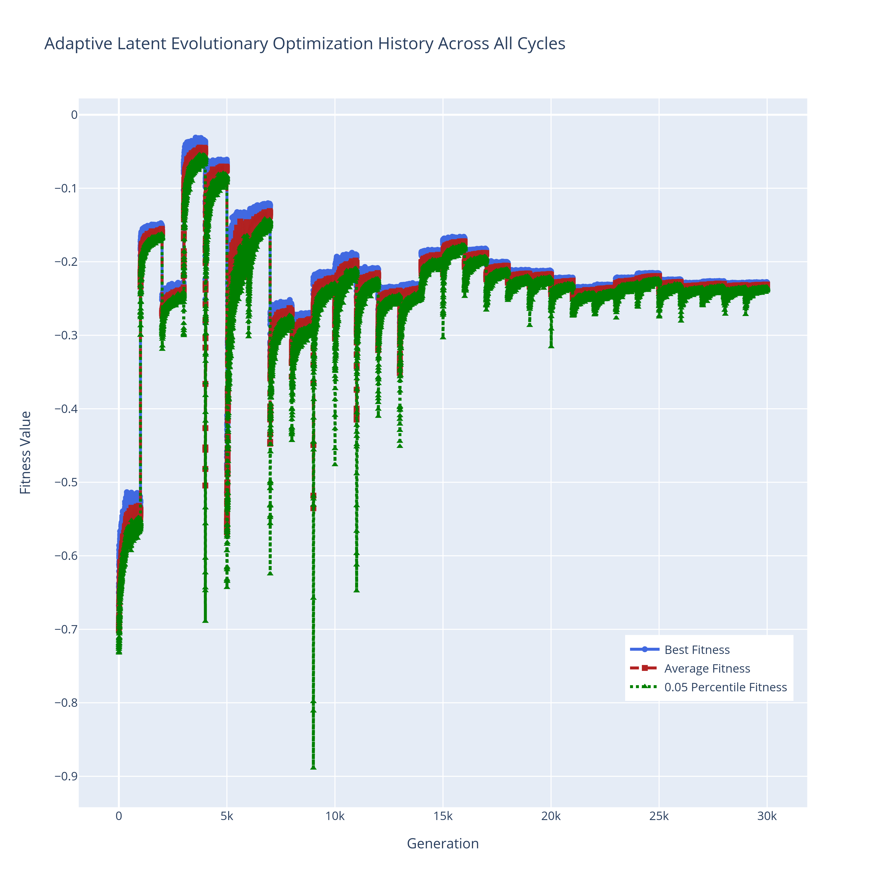
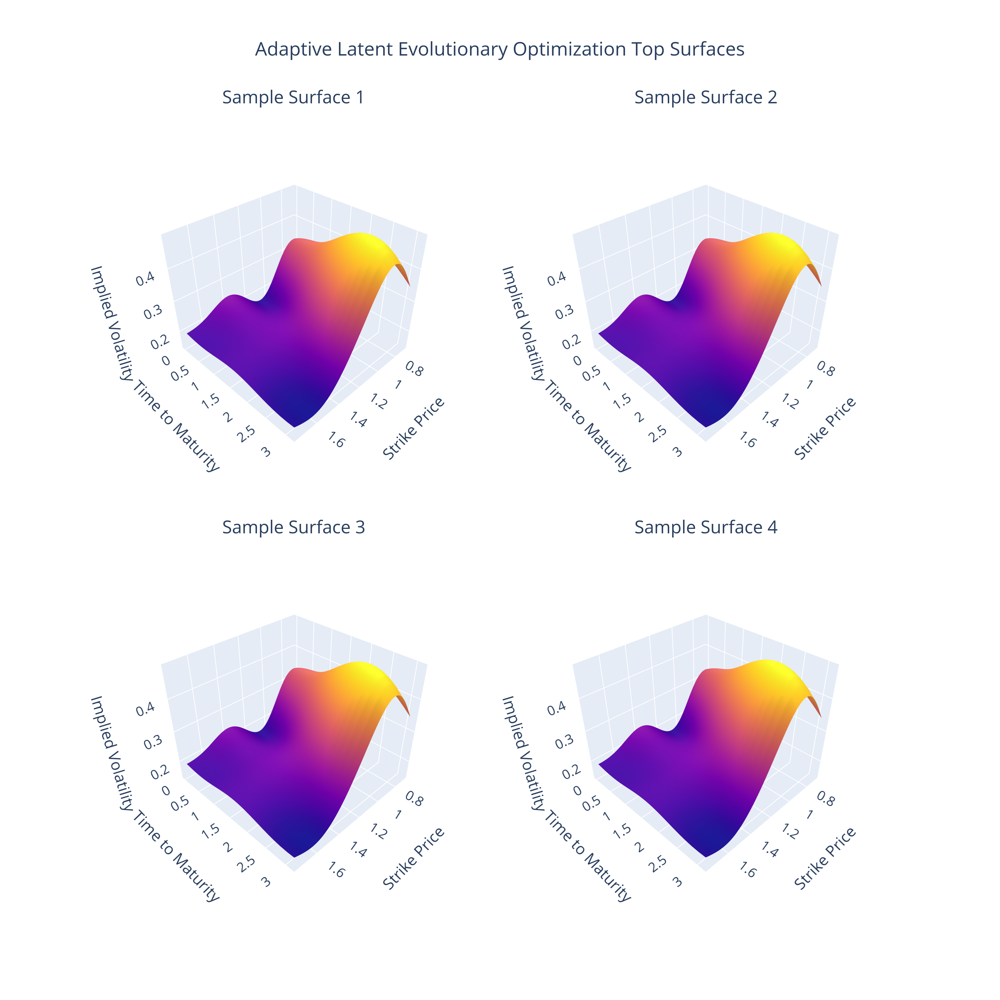

# Ill-Posedness Evolved in the Deep: Adaptive Evolutionary Latent Optimization: An Application to Recovering Volatility

<p align="center">
  
</p>

---

## Abstract

Optimizing complex high-dimensional latent spaces is a fundamental challenge in fields such as quantitative finance, molecular design, and structured data modeling, particularly when addressing ill-posed inverse problems characterized by nonlinearity and implicit input-output relationships. We introduce **Adaptive Evolutionary Latent Optimization (AdELO)**, a novel framework that synergistically combines evolutionary algorithms with generative and objective models to iteratively refine latent space representations and solve complex optimization tasks. AdELO operates by alternating between evolutionary optimization of latent vectors and fine-tuning of both the generative and objective models, effectively navigating the latent space to discover optimal solutions. In our implementation, we utilize beta-Variational Autoencoders (beta-VAEs) to represent the latent space and Physics-Informed Neural Networks (PINNs) to enforce underlying physical laws. We apply AdELO to the recovery of local volatility surfaces from option prices, a quintessential ill-posed inverse problem in financial mathematics known for numerical instability and sensitivity to noise. The volatility surface is parameterized using Gaussian Radial Basis Functions (RBFs) with smoothness priors imposed to regularize the problem. By integrating beta-VAEs and PINNs within the AdELO framework, we effectively reconstruct the local volatility surface from market data. Experimental results demonstrate that AdELO successfully recovers volatility surfaces with high accuracy and stability, mitigating the ill-posedness inherent in the inverse problem. The proposed framework not only advances methodologies for volatility surface recovery but also offers a generalizable optimization paradigm applicable to a wide spectrum of complex, high-dimensional problems in science and engineering.

---

<p align="center">   </p>

---

## Parameterization of the Volatility Surface

We parameterize the volatility surface using Gaussian Radial Basis Functions (RBFs) and smoothness priors to regularize the problem.

```python
# Define the strike price list and maturity time list
strike_price_list = np.array([0.75, 0.85, 0.9, 0.95, 1.0, 1.05, 1.1, 1.2, 1.3, 1.5])
maturity_time_list = np.array([0.02, 0.08, 0.17, 0.25, 0.5, 0.75, 1.0, 1.5, 2.0, 3.0])

# Create the product grid of maturity times and strike prices
product_grid = list(product(maturity_time_list, strike_price_list))
maturity_times, strike_prices = zip(*product_grid)

# Convert to arrays for further operations
maturity_times = np.array(maturity_times)
strike_prices = np.array(strike_prices)

# Variance formula for log-uniform distribution
def log_uniform_variance(a, b):
    log_term = np.log(b / a)
    var = ((b ** 2 - a ** 2) / (2 * log_term)) - ((b - a) / log_term) ** 2
    return var

# Calculate standard deviations for maturity times and strike prices
maturity_std = np.sqrt(log_uniform_variance(maturity_time_list.min(), maturity_time_list.max()))
strike_std = np.sqrt(log_uniform_variance(strike_price_list.min(), strike_price_list.max()))
```

---

## Experiment Dataset Generation Using SABR and Black-Scholes Models

We generate a synthetic dataset of call option prices using the SABR model for implied volatility and the Black-Scholes model for option pricing.

```python
# Define the SABR model parameters
alpha = 0.20  # Stochastic volatility parameter
beta = 0.50   # Elasticity parameter
rho = -0.75   # Correlation between asset price and volatility
nu = 1.0      # Volatility of volatility parameter

# Other model parameters
risk_free_rate = np.log(1.02)  # Risk-free interest rate
underlying_price = 1.0         # Current price of the underlying asset

# Generate the dataset using the SABR model and Black-Scholes formula
call_option_dataset = generate_sabr_call_options(
    alpha=alpha,
    beta=beta,
    rho=rho,
    nu=nu,
    maturity_times=maturity_times,
    strike_prices=strike_prices,
    risk_free_rate=risk_free_rate,
    underlying_price=underlying_price
)
```

---

## Smoothness Prior and Covariance Matrix

We impose a Gaussian smoothness prior on the volatility surface parameters to ensure smoothness.

```python
n_roots = 350
smoothness_controller = 3.274549162877732e-05

# Initialize the RBFQuadraticSmoothnessPrior class
smoothness_prior = RBFQuadraticSmoothnessPrior(
    maturity_times=maturity_times,
    strike_prices=strike_prices,
    maturity_std=maturity_std,
    strike_std=strike_std,
    n_roots=n_roots,
    smoothness_controller=smoothness_controller,
    random_state=0,
)

prior_covariance_matrix = smoothness_prior.prior_covariance()
prior_eigenvalues = np.sort(np.linalg.eigvalsh(prior_covariance_matrix))[::-1].copy()
```

---

## Physics-Informed Neural Network (PINN) Training

We train a Physics-Informed Neural Network (PINN) to estimate call option prices while satisfying the Dupire forward partial differential equation and initial boundary conditions.

```python
# The constant_volatility is set to a reasonable value
constant_volatility = RBFVolatilitySurface.calculate_constant_volatility(
    call_option_dataset["Implied Volatility"],
    call_option_dataset["Time to Maturity"],
    call_option_dataset["Strike Price"],
    risk_free_rate,
    underlying_price
)

sampled_surface_coefficients = smoothness_prior.sample_smooth_surfaces(1000)

# Initialize the DupirePINNTrainer class
hidden_dim = 64
n_layers = 8
batch_size = 100
pde_loss_coefficient = 650.0
maturity_zero_loss_coefficient = 800.0
strike_zero_loss_coefficient = 40.0
strike_infinity_loss_coefficient = 200.0
pre_train_learning_rate = 1e-3
fine_tune_learning_rate = 1e-3
pre_train_epochs = 200
fine_tune_epochs = 6
maturity_min = maturity_time_list.min()
maturity_max = maturity_time_list.max()
strike_min = strike_price_list.min()
strike_max = strike_price_list.max()
volatility_mean = np.mean(sampled_volatilities)
volatility_std = np.std(sampled_volatilities)
strike_infinity = 2.5
device = 'cpu'

torch.manual_seed(0)
pinn_trainer = DupirePINNTrainer(
    hidden_dim=hidden_dim,
    n_layers=n_layers,
    batch_size=batch_size,
    pde_loss_coefficient=pde_loss_coefficient,
    maturity_zero_loss_coefficient=maturity_zero_loss_coefficient,
    strike_zero_loss_coefficient=strike_zero_loss_coefficient,
    strike_infinity_loss_coefficient=strike_infinity_loss_coefficient,
    pre_train_learning_rate=pre_train_learning_rate,
    fine_tune_learning_rate=fine_tune_learning_rate,
    pre_train_epochs=pre_train_epochs,
    fine_tune_epochs=fine_tune_epochs,
    maturity_min=maturity_min,
    maturity_max=maturity_max,
    strike_min=strike_min,
    strike_max=strike_max,
    volatility_mean=volatility_mean,
    volatility_std=volatility_std,
    maturity_time_list=maturity_time_list,
    strike_price_list=strike_price_list,
    strike_std=strike_std,
    maturity_std=maturity_std,
    constant_volatility=constant_volatility,
    strike_infinity=strike_infinity,
    device=device
)

pinn_trainer.load_model()

pinn_trainer.dupire_price_prediction_loss(
    torch.tensor(sampled_surface_coefficients, device=device, dtype=torch.float32),
    call_option_dataset["Call Option Price"],
    call_option_dataset["Time to Maturity"],
    call_option_dataset["Strike Price"],
)
```

---

## Beta-VAE Training for Dimensionality Reduction

We use a beta-Variational Autoencoder (beta-VAE) to encode the high-dimensional volatility surface parameters into a lower-dimensional latent space.

```python
latent_dim = 40  # Latent dimension
data_dim = 100  # Data dimension of input
hidden_dim = 512
n_layers = 8
latent_diagonal = prior_eigenvalues[:latent_dim]  # Eigenvalues for latent prior
batch_size = 1000  # Batch size for training
beta_ = 1.0  # Beta value for beta-VAE
pre_train_learning_rate = 1e-3
fine_tune_learning_rate = 1e-3  # Fine-tune learning rate
pre_train_epochs = 600  # Number of pre-train epochs
fine_tune_epochs = 6  # Number of fine-tune epochs
device = "cpu"  # Use CPU as the device

torch.manual_seed(2)
vae_trainer = SurfaceVAETrainer(
    latent_dim=latent_dim,
    hidden_dim=hidden_dim,
    n_layers=n_layers,
    data_dim=data_dim,
    latent_diagonal=latent_diagonal,
    batch_size=batch_size,
    beta=beta_,
    pre_train_learning_rate=pre_train_learning_rate,
    fine_tune_learning_rate=fine_tune_learning_rate,
    pre_train_epochs=pre_train_epochs,
    fine_tune_epochs=fine_tune_epochs,
    device=device,
)

vae_trainer.load_model()
```

---

## Adaptive Evolutionary Latent Optimization (AdELO) Implementation

We implement the AdELO framework, integrating the beta-VAE and PINN within an evolutionary algorithm to iteratively optimize the latent vectors and refine the models.

```python
population_size = 100  # Population size
mutation_strength = 1.0  # Mutation strength for Gaussian noise
selection_pressure_parameter = 0.7  # Selection pressure parameter (eta)
n_generations = 1000  # Number of generations for the evolutionary process
truncation_clip = 3
n_cycles = 30
torch.manual_seed(2)

# Initialize the AdaptiveEvolutionaryLatentOptimization
adelo = AdaptiveEvolutionaryLatentOptimization(
    vae_trainer=vae_trainer,
    pinn_trainer=pinn_trainer,
    latent_diagonal=latent_diagonal,
    population_size=population_size,
    mutation_strength=mutation_strength,
    selection_pressure_parameter=selection_pressure_parameter,
    n_generations=n_generations,
    truncation_clip=truncation_clip,
    n_cycles=n_cycles
)

# Run the optimization process
adelo.run_cycle()

# Plot the optimization process
adelo.plot_evolutions()
```

---

## Conclusion

Through AdELO, we effectively reconstruct the local volatility surface from market data, mitigating the ill-posedness inherent in the inverse problem. The proposed framework advances methodologies for volatility surface recovery and offers a generalizable optimization paradigm applicable to a wide spectrum of complex, high-dimensional problems in science and engineering.

---

Please refer to the [paper](link_to_paper_if_available) for detailed explanations and additional results.

---
