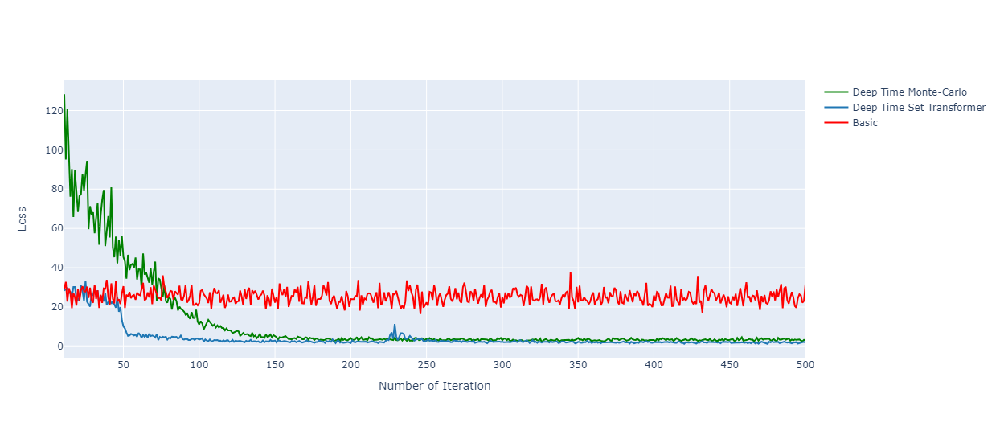

# Deep Time Neural Network for PDEs

## Overview

This repository provides implementation and solutions for Partial Differential Equations (PDEs) , utilizing the Deep Time Neural Network architecture.
```bibtex
@article{aghapour2023deep,
  title={Deep-Time Neural Networks: An Efficient Approach for Solving High-Dimensional PDEs},
  author={Aghapour, Ahmad and Arian, Hamid R and Seco, Luis A},
  journal={Available at SSRN},
  year={2023}
}
```

## Structure

The repository is structured into four primary files/folders:

- **`Equation.py`**: Contains definitions and functions related to PDEs.
- **`Model.py`**: Includes the implementation of the Deep Time Neural Network architecture.
- **`Solver.py`**: Features a solver class that accepts PDEs and offers methods to solve them.
- **`Deep_Time_Neural_Network.ipynb`**: A Jupyter Notebook for executing the code and printing results.

## Installation

Before using the code, install the required library with the following command:

```shell
!pip install RiskLabAI
```

## How to Use

First, import the necessary libraries and `RiskLabAI`:

```python
import RiskLabAI
import torch
import numpy as np
```

Now, you can proceed to solve PDEs for option pricing with default risk. Here is an example code:

```python
config = {
  "dim": 100,
  "total_time": 1,
  "num_time_interval": 50
}

pde = RiskLabAI.pde.PricingDefaultRisk(config)
device = torch.device('cuda')

fastsolver = RiskLabAI.pde.FBSDESolver(pde,[150,400,500,400,150],0.001,'Basic')
losses, inits = fastsolver.solve(500, 128, (40 + torch.rand(1)*10).to(device), device)
```

The `'Basic'` method is used here; you can replace it with `'Monte-Carlo'` or `'Deep-Time-SetTransformer'` proposed in the paper.

## Results

To visualize the results, refer to the `Deep_Time_Neural_Network.ipynb` notebook or execute the code in your preferred environment.

### Sample Result




